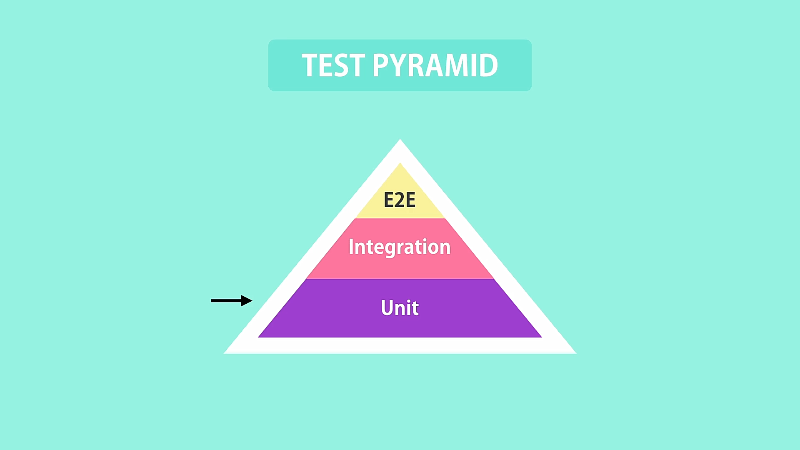

# Automated Testing

## What is automated-testing

The practice of writing code to tests our code, and then run those tests in an automated fashion.

with automated-testing our source code consists of

- source/production code
- test code

### manual testing

Imagine you have a function in your application that takes a value and returns different results based on some conditions, to test that manually you need to:

- launch your application on the browser
- perhaps log-in
- navigation you may need to do a few clicks here and there
- fill out the form and submit
- verify the results

this process can take quite some time

### automated testing

you can directly call that function with different values and verify the results directly in the source-code

## Benefits of automated testing

- test your code frequently
- catch bugs before deploying
- deploy with confidence
- refactor with confidence
  -\*refactoring\*\* means changing the structure of your code without changing its behavior.

  - extracting a few lines of code from a method into a private method.
  - renaming a method

  after refactoring your code you need to test the application to ensure that nothing broke, doing so with manual testing is time consuming and difficult to do but with automated-testing you can easily run all the related tests and make sure everything works.

- focus more on quality

## Types of tests

### Unit Test

Tests a unit of an application without its **external dependencies**, i,e database, message-que, files, web-services etc...

- cheap to write, you can write more test in less time
- execute fast, you can execute a lot of unit-test in less time
- doesn't give a lot of confidence, because your are testing your app without it's external dependencies it doesn't give confidence of your application working properly.

### Integration Tests

Tests an application or class of an application with it's **external dependencies**

- takes longer to execute because involves reading/writing to a database or other services.
- give confidence about the behavior of your application.

testing a few parts of your application as a whole is not an **integration test** this is a poor way to define integration tests

**Note**: A unit-test tests a unit of work wither it is a single function/class or a combination of classes. on the other hand an Integration-test tests a single function/class or a combination of functions/classes with their **external dependencies**.

### End-To-End Tests

Tests an application through it's UI. there are tools that drive the application through it's UI and recodes user interactions then plays it back so you can see and make sure that your application is working properly.

- give the greatest confidence
- slow to run, you need to go through each step for the recording
- very brittle, even a small change in the UI can break these tests

### Which kind fo these tests do we need to have in our application

We need all of those test types in our application but the ration between **unit tests**, **integration tests** and **end-to-end tests** is different for each project.

there is a thing called testing-pyramid

majority of tests should be **unite-test** beside that you should include a bunch of **integration-tests** to ensure that the your application works fine with it's external dependencies and a few **E2E** tests for the final testing.

