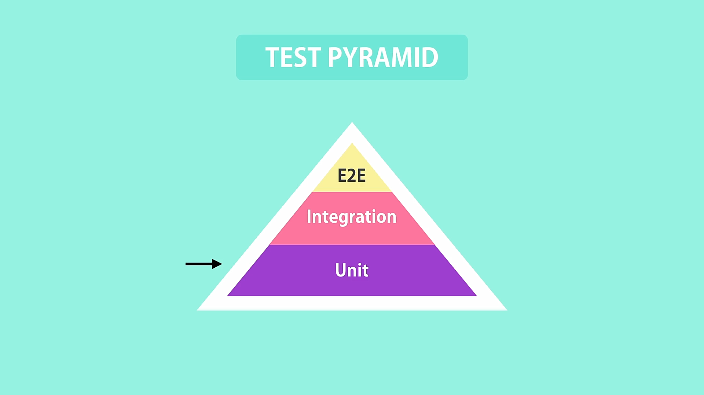

# Automated Testing

## What is automated-testing

The practice of writing code to tests our code, and then run those tests in an automated fashion.

with automated-testing our source code consists of

- source/production code
- test code

### manual testing

Imagine you have a function in your application that takes a value and returns different results based on some conditions, to test that manually you need to:

- launch your application on the browser
- perhaps log-in
- navigation you may need to do a few clicks here and there
- fill out the form and submit
- verify the results

this process can take quite some time

### automated testing

you can directly call that function with different values and verify the results directly in the source-code

## Benefits of automated testing

- test your code frequently
- catch bugs before deploying
- deploy with confidence
- refactor with confidence
  -\*refactoring\*\* means changing the structure of your code without changing its behavior.

  - extracting a few lines of code from a method into a private method.
  - renaming a method

  after refactoring your code you need to test the application to ensure that nothing broke, doing so with manual testing is time consuming and difficult to do but with automated-testing you can easily run all the related tests and make sure everything works.

- focus more on quality

## Types of tests

### Unit Test

Tests a unit of an application without its **external dependencies**, i,e database, message-que, files, web-services etc...

- cheap to write, you can write more test in less time
- execute fast, you can execute a lot of unit-test in less time
- doesn't give a lot of confidence, because your are testing your app without it's external dependencies it doesn't give confidence of your application working properly.

### Integration Tests

Tests an application or class of an application with it's **external dependencies**

- takes longer to execute because involves reading/writing to a database or other services.
- give confidence about the behavior of your application.

testing a few parts of your application as a whole is not an **integration test** this is a poor way to define integration tests

**Note**: A unit-test tests a unit of work wither it is a single function/class or a combination of classes. on the other hand an Integration-test tests a single function/class or a combination of functions/classes with their **external dependencies**.

### End-To-End Tests

Tests an application through it's UI. there are tools that drive the application through it's UI and recodes user interactions then plays it back so you can see and make sure that your application is working properly.

- give the greatest confidence
- slow to run, you need to go through each step for the recording
- very brittle, even a small change in the UI can break these tests

### Which kind fo these tests do we need to have in our application

We need all of those test types in our application but the ration between **unit tests**, **integration tests** and **end-to-end tests** is different for each project.

there is a thing called testing-pyramid



majority of tests should be **unite-test** beside that you should include a bunch of **integration-tests** to ensure that the your application works fine with it's external dependencies and a few **E2E** tests for the final testing.

**Note**: In the package.json under **scrips** object change **test** from it's default values to **jest** so you can start testing with jest by running this command.

**Naming Convention**: files that ends with _test|spec_ will be executed by **Jest** to run tests.

**Note**: Note: the number of test should be greater than or equal to the number of execution paths

## Unit-Testing

Jest is a popular JavaScript testing framework used for testing JavaScript code, including React applications. In Jest, a "test" is a function that defines a set of assertions to verify that a piece of code behaves as expected. The `test` function is a global function provided by Jest for defining individual test cases.

Here's a basic example of how the `test` function is used in Jest:

```javascript
// myModule.test.js

const myModule = require("./myModule");

test("adds 1 + 2 to equal 3", () => {
  expect(myModule.add(1, 2)).toBe(3);
});
```

In this example:

1. The `test` function is used to define a test case.
2. The first argument to the `test` function is a string that describes what the test is checking. In this case, it's checking if the `add` function of `myModule` correctly adds 1 and 2 to equal 3.
3. The second argument is a function that contains the actual test code. This function typically contains one or more assertions.

Inside the test function, you'll often see the use of Jest's `expect` function along with various matcher functions. Matchers are functions that check whether a value meets certain conditions. In the example, `toBe` is a matcher that checks if the result of `myModule.add(1, 2)` is exactly equal to `3`.

Jest provides a variety of matchers for different types of assertions. Some common ones include:

- `toBe(value)`: Checks if the value is exactly equal to the expected value.
- `toEqual(value)`: Checks if the value is deeply equal to the expected value.
- `toBeTruthy()`: Checks if the value is truthy.
- `toBeFalsy()`: Checks if the value is falsy.
- `toContain(item)`: Checks if an array or string contains the specified item.

These are just a few examples, and Jest has many more matchers that you can use to create expressive and powerful tests for your JavaScript code.

### Grouping tests

As we write more tests i becomes more and more confusing to to look at and try to figure out what is what, specially for other programmers.


Note: _if you are gonna write missy and unmaintainable tests it is better to NOT WRITE at all_

### Testing Numbers

```js
test("absolute - should return a positive number if input is positive", () => {
  const result = absolute(1);
  expect(result).toBe(1);
});

test("absolute - should return positive number if input is negative", () => {
  const result = absolute(-1);
  expect(result).toBe(1);
});

test("absolute - should return 0 if input is 0", () => {
  const result = absolute(0);
  expect(result).toBe(0);
});
```

Jest provides `describe` function which is used to group related tests, also there is `it` function which replaces `test` function inside `describe` function and makes reading tests a whole lot easier just like plain English.

```js
const { absolute } = require("./lib");

describe("absolute", () => {
  it("should return a positive number if input is positive", () => {
    const result = absolute(1);
    expect(result).toBe(1);
  });

  it("should return positive number if input is negative", () => {
    const result = absolute(-1);
    expect(result).toBe(1);
  });

  it("should return 0 if input is 0", () => {
    const result = absolute(0);
    expect(result).toBe(0);
  });
});
```

### Refactor with confidence

With having tests in place you don't need to worry about the code you write unless you change the behavior of your code.

here we're implementing the same logic in different ways keeping the behavior of the function unchanged.

```js
// Testing Numbers
module.exports.absolute = function (num) {
  // if(num > 0)return num;
  // if(num < 0)return -num;
  // return 0
  // change the implementation
  // if(num >= 0)return num;
  // return -num
  // change the implementation
  return num < 0 ? -num : num;
};
```

### Testing Strings

When testing strings the tests should neither be too specific nor too general

`function to be tested`

```js
module.exports.greet = function (name) {
  return "Hello " + name;
};
```

`tests`

```js
describe("greet", () => {
  it("should return Hello Mostafa", () => {
    const result = greet("Mostafa");
    expect(result).toBe("Hello Mostafa");
    // the value in give to "toBe" checker is too specific and will break with smallest change
  });
});
```
